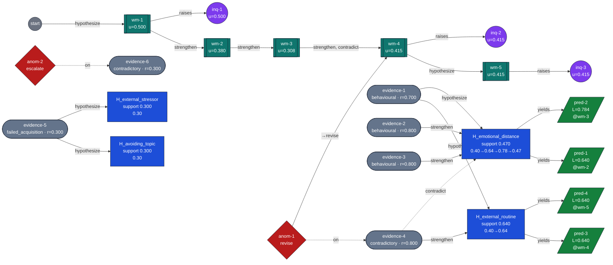

# Sanuvia — Persistent Reasoning Core: Reasoning Lineage Graph

The visual companion to `reasoning_trace.md`. Generated automatically from the RevisionLedger and the immutable reasoning objects — not hand-drawn. Re-running produces an identical diagram.

**Legend** — `[[version]]` WorldModel version · `([evidence])` · `[hypothesis]` · `[/prediction/]` · `((inquiry))` · `{anomaly}`. Solid evidence→hypothesis edges strengthen/hypothesise; dashed edges contradict.

